# Kotlin's Scope Functions

1. Scope functions establish a scope with lambdas to execute operations on a context object.
2. Finally, they return the result of the lambda or the context object.

### 🙋‍♂️So what's the point? 

More concise and readable code. Because:

1. Inside the Scope Functions'  scope, you may access the context object without its name. The context object is made available either as a **lambda argument** (default name is `it`) or as a **lambda receiver** (accessible via the `this` keyword). 

2. Either the lambda result or the context object is returned.

   

> 📖 The concepts behind these functions should be understandable even without Kotlin knowledge. However, to fully understand the examples you probably want some background knowledge about lambdas in Kotlin. 
>
> 1. [The trailing lambda syntax.](https://kotlinlang.org/docs/lambdas.html#passing-trailing-lambdas)
> 2. `it`: [the implicit name of a single parameter lambda.](https://kotlinlang.org/docs/lambdas.html#it-implicit-name-of-a-single-parameter)
> 3. The last expression in a lambda is considered the return value (explicit `return` not needed).


# Extension Scope Functions

Below is a summary graph of scope functions that are also extension functions (They may be invoked via the context object). 

```kotlin
val contextObject = Person();
contextObject.let{...}
contextObject.run{...}
contextObject.also{...}
contextObject.apply{...}
```





```mermaid
graph LR
contextObject("context object 🧑")-- it -->let
contextObject--this-->run
contextObject-- it -->also
contextObject--this-->apply
let("let 🤷")-->lamdaResult("lamda result 🧮")
run("run 🏃‍♂️")-->lamdaResult
also("also 💡")--> contextObjectReturn("context object 🧑")
apply("apply ✍️")--> contextObjectReturn 

```

## let 🤷

1. The context object is available as a **lambda argument** with the default name of `it`.
2.  The return value is the **lambda result**.


```kotlin
val frostDragon = Dragon()
val speech = frostDragon.let {
    it.attack(hero)
    hero.fight(it)
    it.speak()
}
print(speech)
```


## run 🏃‍♂️

1- The context is available as a **lambda receiver** accessible via the `this` keyword in the function's scope (`this` can also be omitted).
2- The return value is the **lambda result**.


```kotlin
val frostDragon = Dragon();
val victorySpeech = frostDragon.run {
    // this.attack(hero)
    // this.giveVictorySpeech() OR:
    attack(hero)
    giveVictorySpeech()
}
print(victorySpeech)
```


## also 💡

1. The context object is available as a **lambda argument** with the default name of `it`.
2. The return value is the **context object**.

```kotlin
val frostDragon = Dragon();
val dragonRacer = DragonRacer();
registerMountedDragon(frostDragon.also{dragonRacer.mount(it)})
```


## apply ✍️

1. The context is available as a **lambda receiver** accessible via the `this` keyword in the function's scope (`this` can also be omitted).
2.  The return value is the **context object**.

```kotlin
val frostDragon = Dragon();
hero.attackWeakDragon(
    frostDragon.apply {
        // this.power = 1
        // this.setHealth(0.1) OR:
        power = 1
        setHealth(0.1)
})
```


# Other Scope(ish) Functions

```mermaid
graph LR
contextObject("context object 🧑")--it-->takeIf
contextObject--this-->with
contextObject--it-->takeUnless
takeIf("takeIf 🙍‍♂️")-->contextObjectN("context object 🧑 OR null 💥")
with("with ❤️")-->lambdaResult("lambda result 🧮")
takeUnless("takeUnless 🙍‍♀️")--> contextObjectN("context object 🧑 OR null 💥")

```




## takeIf 🙍‍♂️

1. The context object is available as a **lambda argument** with the default name of `it`.
2. Provide a predicate when calling this function. If the predicate evaluates to `true`, the **context object** is returned, else, **null** is returned.

> 🗒️ This seems to be not considered as a scope function by the documentation.  Although it shares similar anatomy and also aims to produce more concise and readable code, the way it goes about achieving that is slightly different.  

> ❗ Remember to guard against potential null values returned from this function by using a safe call (`?.`).

```kotlin
val frostDragon = Dragon();
frostDragon.takeIf{it.hasWings}?.fly();
```


## takeUnless 🙍‍♀️

1. The context object is available as a **lambda argument** with the default name of `it`.
2. Provide a predicate when calling this function. If the predicate evaluates to `false`, the **context object** is returned, else, **null** is returned.

> 🗒️ This seems to be not considered as a scope function by the documentation.  Although it shares similar anatomy and also aims to produce more concise and readable code, the way it goes about achieving that is slightly different.  

> ❗ Remember to guard against potential null values returned from this function by using a safe call (`?.`).

```kotlin
val frostDragon = Dragon();
frostDragon.takeUnless{it.isScaredOfWater && it.age > 5}?.fly();
```


## with ❤️

1. The context is available as a **lambda receiver** accessible via the `this` keyword in the function's scope (`this` can also be omitted).
2. The return value is the **lambda result**.

> 🗒️ Note that `with` is not an extension function, you need to pass the context object as an argument to it.

```kotlin
val frostDragon = Dragon();
val calories = with(frostDragon){
    // this.goToVillage()
    // this.attackVillage() 
    // this.eatVillageCrops() OR:
	goToVillage();
	attackVillage();
	eatVillageCrops();
}
print(calories)
```
